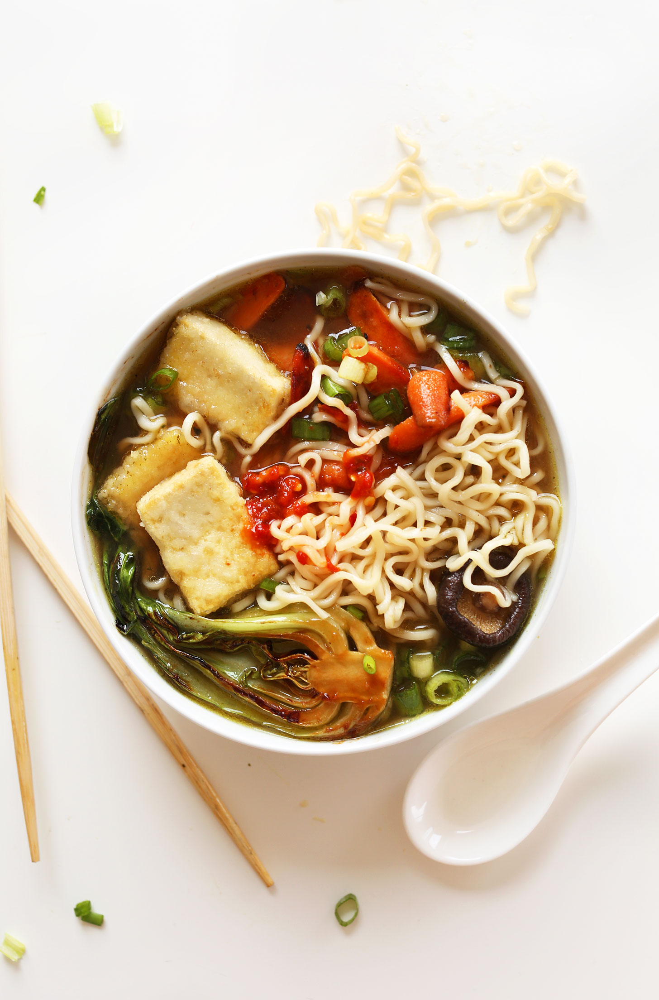

# :ramen: Easy Vegan Ramen

{ loading=lazy }

| :fork_and_knife_with_plate: Serves | :timer_clock: Total Time |
|:----------------------------------:|:-----------------------: |
| 4 | 1.22 hours |

## :salt: Ingredients - Ramen

- :olive: 1 Tbsp olive oil
- :garlic: 5 cloves garlic
- :sweet_potato: 1 3-inch ginger
- :onion: 1 medium yellow onion
- :stew: 6 cups vegetable broth
- :sake: 2 Tbsp tamari or soy sauce
- :mushroom: 0.5 oz dehydrated shiitake mushrooms
- :oil_drum: 1 tsp sesame oil
- :ramen: 1 Tbsp white or yellow miso paste
- :ramen: 8 oz ramen noodles

## :salt: Ingredients - Topping

- :butter: 10 oz extra-firm tofu
- :carrot: some [miso-glazed carrots][2] (optional)
- :leafy_green: some [miso-glazed baby bok choy][1] (optional)
- :seedling: 0.5 cup chopped green onion (optional)
- :hot_pepper: some chili garlic sauce (optional

## :cooking: Cookware

- 1 large pot
- 1 large saucepan or pot

## :pencil: Instructions

### Step 1

Heat a large pot over medium-high heat.

### Step 2

Once hot, add olive oil, garlic, ginger, and yellow onion. Sauté, stirring occasionally for 5 to 8 minutes or until the
onion has developed a slight sear (browned edges).

### Step 3

Add 1 cup (240 ml // amount as original recipe is written // adjust if altering batch size) of the vegetable broth to
deglaze the bottom of the pan. Use a whisk (or wooden spoon) to scrape up any bits that may have stuck to the bottom to
enhance the flavor of the broth.

### Step 4

Add remaining 5 cups (1200 ml // amount as original recipe is written // adjust if altering batch size) vegetable broth,
tamari or soy sauce, and dehydrated shiitake mushrooms - stir.

### Step 5

Bring to a simmer over medium heat, then reduce heat to low and cover. Simmer on low for at least 1 hour, up to 2 to 3,
stirring occasionally. The longer it cooks, the more the flavor will deepen and develop.

### Step 6

Taste broth and adjust seasonings as needed, adding more soy sauce or sesame oil if desired. Add the white or yellow
miso paste at this time.

### Step 7

When you’re 30 minutes from serving, prepare any desired toppings (see notes for miso-glazed carrots (optional),
miso-glazed baby bok choy (optional), and quick-seared extra-firm tofu).

### Step 8 - Noodles

Fill a large saucepan or pot with water and bring to a boil. Once boiling, add ramen noodles (depending on size
of pan you may need to do this in two batches // use fewer or more batches if altering batch size) and cook according to
package instructions – about 4 to 5 minutes. Drain and set aside.

### Step 9

Strain broth and reserve mushrooms for serving. (Save onions and ginger for serving as well, if desired, though I
discarded them).

### Step 10

To serve, divide ramen noodles between four (amount as original recipe is written // adjust if altering batch size)
serving bowls. Top with strained broth and desired toppings, such as [miso-glazed carrots][2],
[miso-glazed bok choy][1], chopped green onion (optional), or seared tofu. Serve with chili garlic sauce (optional)
for added heat.

### Step 11

Best when fresh, though the broth can be stored (separately) in the refrigerator for up to 5 days and in the freezer for
up to 1 month.

## :link: Source

- <https://minimalistbaker.com/easy-vegan-ramen/#wprm-recipe-container-35499>

[1]: <../sides/miso-glazed-bok-choy.md>
[2]: <../sides/miso-glazed-carrots.md>
