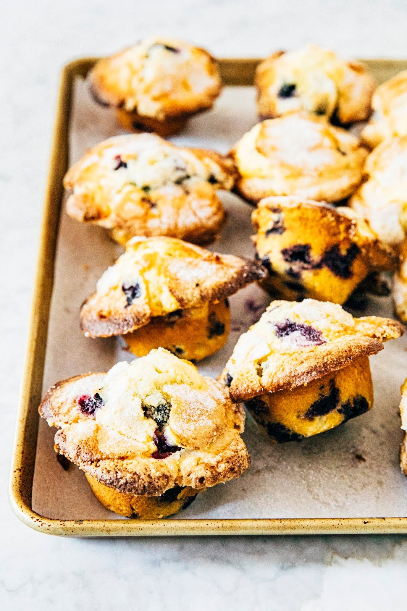

# :cupcake: Levain Bakery Blueberry Muffins

{ loading=lazy }

| :fork_and_knife_with_plate: Serves | :timer_clock: Total Time |
|:----------------------------------:|:-----------------------: |
| 9 | 1.67 hours |

## :salt: Ingredients

- :ear_of_rice: 2 cups all-purpose flour
- :chestnut: 0.5 cup almond meal or flour
- :dash: 2 tsp baking powder
- :salt: 0.5 tsp salt
- :glass_of_milk: 0.5 cup whole milk
- :icecream: 1 tsp vanilla
- :candy: 1 cup granulated sugar
- :butter: 0.5 cup unsalted butter
- :egg: 2 large eggs
- :blue_circle: 2.5 cups blueberries

## :cooking: Cookware

- 1 medium bowl
- 1 small liquid measuring cup
- 1 stand mixer
- 1 rubber spatula
- 1 plastic wrap
- 1 offset spatula

## :pencil: Instructions

### Step 1

In a medium bowl, whisk together the all-purpose flour, almond meal or flour, baking powder, and salt. In a small liquid
measuring cup, whisk together the whole milk and the vanilla.

### Step 2

In the bowl of a stand mixer fitted with the paddle attachment, combine the granulated sugar and unsalted butter. Beat
on medium-high until light, fluffy, and doubled in volume, 2 to 3 minutes, using a rubber spatula to scrape down the
bottom and sides of the bowl as necessary. Reduce the mixer to low and add the eggs one at a time, adding the next egg
only after the previous one is fully incorporated, scraping down the bottom and sides of the bowl after each addition.

### Step 3

With the mixer still on low, add the dry ingredients in three equal parts, alternating with the wet ingredients in two
parts. Beat until just combined, then scrape down the bottom and sides of the bowl once more, then beat on low for an
additional 30 seconds. Take 1/2 cup of the blueberries and crush them with your hands so they are juicy; add to the
batter and increase the mixer speed to high for 5 to 10 seconds to encourage the berries to release their juices even
more. Immediately reduce the mixer to low and add the rest of the berries, mixing until incorporated evenly throughout
the batter, another 30 seconds.

### Step 4

Cover the bowl with plastic wrap and let the batter rest at room temperature for 1 hour.

### Step 5

While the batter is resting, position a rack in the center of the oven and preheat the oven to 400°F using the
convection setting (if possible). Prepare two muffin tins by spraying the inside and border of every other cavity in the
muffin tin generously with cooking spray.

### Step 6

Use a 1 tablespoon or 3 tablespoon cookie dough scoop to fill each sprayed cavity with 6 tablespoons of the batter. The
first muffin tin will have six cavities filled, whereas the second muffin will have three cavities filled. For the
second muffin tin, you'll need to pour water into every other cavity to mimic the placement of the batter in the first
muffin tin. Sprinkle the top of each cavity, aiming for the batter and avoiding the pan, with 1 teaspoon of granulated
sugar each.

### Step 7

Bake each muffin tin for 18 to 22 minutes, or until the muffins are domed and golden brown around the edges. A skewer
inserted into the center of a muffin should come out with a few crumbs attached. Cool the muffins in their muffin tin on
a wire rack for 15 minutes, then use an offset spatula to run underneath the edges of the blueberry muffin tops to
prevent them from sticking in the pan. Be careful to just run the offset spatula under the edges—you don't want to
accidentally cut into the muffin bottom and decapitate the muffin from its top!

### Step 8

After unsticking the muffin tops, keep cooling the muffins in the tins completely to room temperature. DO NOT TRY AND
TURN THE MUFFINS OUT WHILE THEY ARE STILL WARM. Because these muffins are so top-heavy, you’ll run the risk of
accidentally pulling the tops and bottoms apart if the cake is still warm! Wait until they are cooled completely before
turning them out of the pan. Run the offset spatula underneath each muffin top once more and gently tilt the muffin
upwards to turn it out of the pan. The muffins are best on the day that they’re made, but can be individually wrapped
in plastic and stored at room temperature for up to 2 days.

## :link: Sources

- <https://www.hummingbirdhigh.com/2019/08/levain-bakery-blueberry-muffins.html#wprm-recipe-container-7360>
- <https://www.thepancakeprincess.com/2020/05/19/best-blueberry-muffin-bake-off/>
