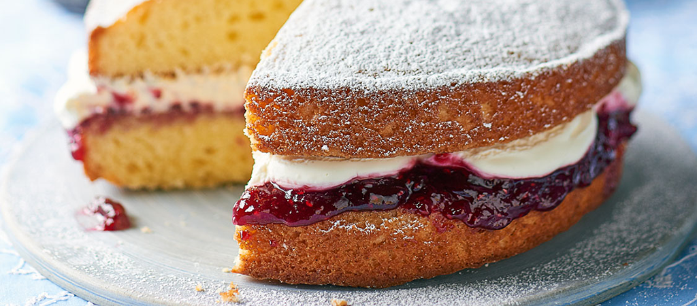

# :cake: Victoria Sandwich Cake

| :fork_and_knife_with_plate: Serves | :timer_clock: Total Time |
|:----------------------------------:|:-----------------------: |
| 8 | 40 minutes |

## :salt: Ingredients - Cake

- :egg: 3 medium eggs
- :butter: 175 g unsalted butter
- :candy: 175 g granulated sugar
- :ear_of_rice: 175 g [self-raising flour][2]
- :icecream: 0.75 tsp vanilla
- :hotsprings: 1 Tbsp warm water

## :salt: Ingredients - Filling

- :icecream: 150 ml whipping cream (optional)
- :strawberry: 6 Tbsp [raspberry jam][1]
- :candy: some confectioners' sugar

## :cooking: Cookware

- 1 cake tins
- 1 large mixing bowl
- 1 plastic spatula
- 1 fork
- 1 large metal spoon or plastic spatula
- 1 round-bladed knife
- 1 wire rack

## :pencil: Instructions - Cake

### Step 1

Preheat the oven to 180°C / 160°C fan / 350°F / Gas 4. Grease and line the cake tins with butter and baking paper.

### Step 2

Weigh the eggs – 3 medium eggs in their shells weigh around 175 g – then use this same weight for the unsalted
butter, granulated sugar and [self-raising flour][2].

### Step 3

Put the soft (but not oily) butter into a large mixing bowl or the bowl of a food mixer and beat well with a wooden
spoon or the whisk attachment until very creamy and mayonnaise-like. Scrape down any butter mixture from the sides of
the bowl with a plastic spatula, then gradually beat in the sugar a couple of tablespoons at a time. Scrape the mixture
off the sides of the bowl again and beat well for 1 minute or until the mixture looks very light and fluffy. Scrape down
the mixture again.

### Step 4

Break the 3 eggs into a small jug, add the 3/4 teaspoon vanilla extract and beat with a fork just until the eggs are
broken up. Gradually add to the butter mixture a tablespoon at a time, beating well after each addition and scraping
down the sides of the bowl from time to time. If the mixture looks like it might be 'splitting' or curdling, rather than
appearing smooth and creamy, stir in a tablespoon of the flour with each of the last two additions of egg.

### Step 5

Sift the rest of the flour onto the mixture. Start to gently fold in the flour with a large metal spoon or plastic
spatula and after two or three movements add the warm water. Keep folding in until the flour is well mixed in and there
are no streaks.

### Step 6

Divide the mixture between the two prepared tins - if you want to be really precise, use your scales, or just do it by
eye, then spread it evenly.

### Step 7

Bake for 20 to 25 minutes until the sponges are a light golden brown, and starting to shrink back from the sides of the
tin. (Check the sponges after 15 minutes and if they aren't baking evenly rotate the trays.) Check that the sponge
springs back when lightly pressed in the middle.

### Step 8

When cooked, take them out of the oven and run a round-bladed knife around the inside of each tin to loosen the sponge.
Leave for 1 minute to firm up, then carefully turn out the cakes onto a wire rack. Leave until they are completely
cooled.

### Step 9

If you are using whipping cream (optional), put a bowl and whisk (or whisk attachment) in the fridge to chill.

### Step 10

To assemble the cake, set one sponge crust-side down on a serving plate. Using the back of a tablespoon, evenly spread
the sponge with the 6 tablespoons of [raspberry jam][1].

## :pencil: Instructions - Filling

### Step 11

Pour the cream, if using, into the chilled bowl and whip with the chilled whisk or attachment until it thickens and soft
peaks form when you lift out the whisk. Spoon the cream onto the cake and then gently smooth it evenly over the jam. Top
with the second sponge, crust-side up, and dust with confectioners' sugar.

!!! info

    A traditional Victoria Sandwich Cake only has raspberry jam in the middle and topped with granulated sugar.

## :link: Source

- <https://thegreatbritishbakeoff.co.uk/recipes/all/victoria-sandwich-cake/>

[1]: <../../sauces-and-dressings/single-jar-of-fruit-jam.md>
[2]: <../../reference/equivalents-and-substitutes.md#self-rising-flour>
