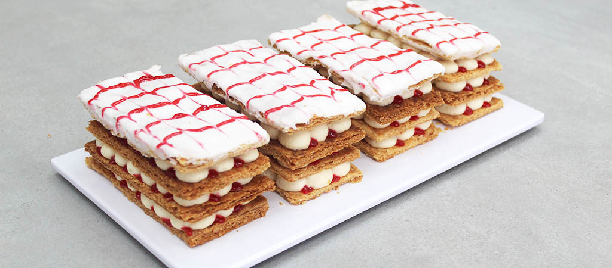

# :cake: Millefeuille

{ loading=lazy }

| :fork_and_knife_with_plate: Serves | :timer_clock: Total Time |
|:----------------------------------:|:-----------------------: |
| 4 | 60 minutes |

## :salt: Ingredients - Rough Puff Pastry

- :butter: 140 g unsalted butter
- :salt: 1 pinch salt
- :ear_of_rice: 225 g all-purpose flour
- :ice_cube: 135 ml very cold water

## :salt: Ingredients - Crème Diplomat

- :egg: 4 egg yolks
- :candy: 110 g granulated sugar
- :ear_of_rice: 50 g all-purpose flour
- :corn: 50 g cornflour
- :glass_of_milk: 580 ml whole milk

## :salt: Ingredients - Raspberry Jam

- :strawberry: 400 g raspberries
- :candy: 400 g jam sugar
- :lemon: 1 lemon juice
- :icecream: 300 ml heavy cream

## :salt: Ingredients - Fondant

- :egg: 4 tsp egg white powder
- :droplet: 4 Tbsp water
- :cake: 400 g white fondant

## :cooking: Cookware

- 1 bowl
- 1 baking trays
- 1 parchment paper
- 1 plastic wrap
- 1 large saucepan
- 1 potato masher
- 1 piping bag

## :pencil: Instructions

### Step 1

To make the rough puff pastry, place the unsalted butter, salt and all-purpose flour in a bowl and then gradually mix
through the very cold water, you may not need all of it. You want to have a soft, not sticky dough. Knead extremely
lightly to bring together and then wrap in plastic wrap and freeze for 5 minutes.

### Step 2

Meanwhile, line two baking trays with parchment paper.

### Step 3

Once the dough has chilled, flour the surface and roll out the dough with sharp taps up and down the dough, rather than
rolling, flouring the surface more if necessary. Continue to tap the dough up and down until it measures 30 cm by 10 cm.

### Step 4

Brush off any excess flour and fold the bottom third up and the top third down and turn so the dough looks like a closed
book. Roll out again to the same size and repeat the fold before freezing again for 10 minutes.

### Step 5

Meanwhile, start making the crème diplomat by making a crème patisserie. Whisk together the egg yolks, granulated
sugar and all-purpose flour and cornflour until well combined and then heat the milk until just before simmering. Add 5
tbsp of whole milk to the egg mixture and whisk together to combine. Gradually add in the remaining milk and whisk until
smooth. Place back in the pan and then bring the mixture to a boil, whisking constantly until thickened. Once thickened,
remove from the heat and then transfer into a bowl and allow to cool completely.

### Step 6

Continue with the pastry and do two more rolls and folds, rolling and folding once more if the butter is still a little
streaked. Rewrap in the plastic wrap and allow to freeze for 10 minutes more. Preheat oven to 220°C / 200°C fan /
425°F / Gas 7.

### Step 7

Once the pastry has chilled, divide in half and roll each piece out carefully to 26 x 26 cm and place on the lined
baking trays. Top with another piece of parchment paper and top with two other baking trays.

### Step 8

Bake for 25 to 30 minutes or until golden and fully cooked through. Once cooked, remove the top baking tray and allow to
cool on the tray.

### Step 9

For the jam, add the raspberries, jam sugar and lemon juice to a large saucepan. Breakdown slightly with a potato
masher, then heat over low until the sugar has melted.

### Step 10

Bring to the boil, then boil for 5 minutes. Remove from the heat and transfer to a bowl to set.

### Step 11

Meanwhile, whisk the crème pat in a stand mixer until smooth. In a separate bowl, whisk the heavy cream to soft peaks,
then use a little of this whipped cream to slacken the crème pat. Fold through the remaining whipped cream. Transfer
into a piping bag with a large round nozzle and then chill until required.

### Step 12

Once the pastry is cool, trim each square to 24 x 24 cm. Divide each square into 8 rectangles that measure 12 x 6 cm.
You should have 16 rectangles.

### Step 13

Sieve a quarter of your jam into a bowl, removing the seeds. Transfer the sieved jam to a piping bag and leave to one
side until needed.

### Step 14

Combine the egg white powder and water to create a smooth paste. Break the block of white fondant into small pieces and
add to the bowl of a stand mixer fitted with a paddle.

### Step 15

Beat the fondant to break it down, then gradually add the egg white liquid. Continue to beat until you have a smooth,
spreadable consistency.

### Step 16

Coat the top of 4 pastry rectangles with the fondant and smooth. Using the sieved jam, create a feathered pattern on
each of the fondant topped rectangles.

### Step 17

Spread the remaining pastry rectangles with a small amount of jam, then pipe 3 long rows of crème diplomat blobs to
cover.

### Step 18

To build the millefeuille, stack three crème diplomat topped rectangles on top of each other, then top with a feathered
fondant rectangle.

### Step 19

Repeat with the remaining pastry rectangles until you have 4 millefeuille.

## :link: Source

- <https://thegreatbritishbakeoff.co.uk/recipes/all/prue-leith-millefeuille/>
