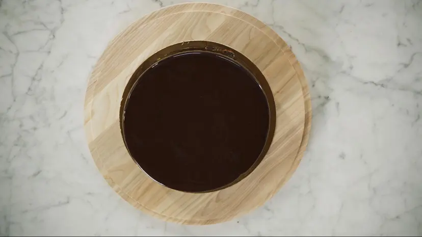

# :chocolate_bar: Dark Chocolate Mirror Glaze

| :fork_and_knife_with_plate: Serves | :timer_clock: Total Time |
|:----------------------------------:|:-----------------------: |
| 8 inch cake | 30 minutes |

## :salt: Ingredients

- :candy: 206 g granulated sugar
- :icecream: 142 g heavy cream
- :custard: 12 g gelatin, powdered
- :ice_cube: 60 g cold water
- :droplet: 148 g room temperature water
- :chocolate_bar: 71 g unsweetened cocoa powder

## :cooking: Cookware

- 1 medium pot
- 1 bowl
- 1 spatula
- 1 heatproof bowl

## :pencil: Instructions

!!! tip

    Make this the day before you’re ready to glaze your cake, as the glaze needs to set in the fridge first before
    using.

### Step 1

In a medium pot, bring granulated sugar and heavy cream to a boil over medium heat, stirring until the sugar dissolves.

### Step 2

In a small bowl, dissolve the gelatin, powdered in 60 g (1/4 cup) of cold water.

### Step 3

In a bowl, combine the 148 g (2/3 cups) room temperature water with the unsweetened cocoa powder, stirring with a
spatula until it becomes a uniform paste.

### Step 4

Stir the bloomed gelatin into the cream-sugar mixture until dissolved, then stir in the cocoa powder paste until
combined. Remove the pot from the heat, and pour the glaze mixture through a mesh strainer over a heatproof bowl to
remove any clumps of undissolved cocoa powder. Emulsify the mixture with a hand blender to remove any lumps, until
smooth.

### Step 5

Cover and chill in the fridge overnight to set, until ready to use.

### Step 6

When you’re ready to glaze your cake, remove the glaze from the fridge and heat in the microwave until it’s exactly
86 to 95°F (30 to 35°C), so it’s liquid and pourable and will give your cake a shiny, uniform finish. If it looks
like it’s slightly separated, use a hand blender to blitz it together. Make sure to tap the container a bit so that
the bubbles from blending go away.

## :link: Source

- Dominique Ansel
