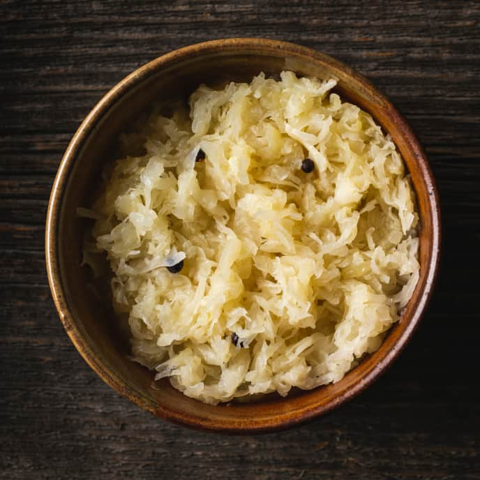

# :leafy_green: Sauerkraut

| :fork_and_knife_with_plate: Serves | :timer_clock: Total Time |
|:----------------------------------:|:-----------------------: |
| 24 | 30 minutes |

## :salt: Ingredients

- :leafy_green: 1 head green cabbage
- :salt: 2 Tbsp pickling and canning salt
- :strawberry: 1.5 tsp juniper berries
- :droplet: 2 cups water

## :cooking: Cookware

- 1 parchment paper
- 1 1/2 gallon glass or ceramic container
- 1 large bowl
- 1 1 quart zipper-lock bag
- 1 cheesecloth
- 1 rubber band

## :pencil: Instructions

!!! note

    To help the cabbage stay submerged, we place a bag of brine on top to weigh it down. We use brine (rather than
    water) because if the bag breaks it won’t ruin the careful balance of salinity inside the jar. For a balanced
    flavor, we prefer fermenting at a cool room temperature of 65 degrees (consider locations such as a basement, den,
    or cabinet in an air-conditioned room). We don’t recommend fermenting above 70 degrees as the flavor suffers, and
    above 75 degrees food safety becomes a concern. You will need cheesecloth for this recipe.

### Step 1

Cut out parchment paper round to match diameter of 1/2 gallon glass or ceramic container. Toss green cabbage with 4
teaspoons pickling and canning salt in large bowl. Using your hands, forcefully knead salt into cabbage until it has
softened and begins to release moisture, about 3 minutes. Stir in juniper berries.

### Step 2

Tightly pack cabbage mixture and any accumulated liquid in jar, pressing down firmly with your fist to eliminate air
pockets as you pack. Press parchment round flush against surface of cabbage.

### Step 3

Dissolve remaining 2 teaspoons salt in water and transfer to 1 quart zipper-lock bag; squeeze out air and seal bag well.
Place bag of brine on top of parchment and gently press down. Cover jar with triple layer of cheesecloth and secure with
rubber band.

### Step 4

Place jar in cool room-temperature location (50°F to 70°F; do not expose cabbage to temperatures above 70°F) away
from direct sunlight and let ferment for 6 days; check jar daily, skimming residue and mold from surface and pressing to
keep cabbage submerged. After 6 days, taste sauerkraut daily until it has reached desired flavor (this may take up to 7
days longer; sauerkraut should be pale and translucent with a tart and floral flavor).

### Step 5

When sauerkraut has reached desired flavor, remove cheesecloth, bag of brine, and parchment and skim off any residue or
mold. Serve. (Sauerkraut and accumulated juices can be transferred to clean jar, covered, and refrigerated for up to 2
months; once refrigerated, flavor of sauerkraut will continue to mature.)

## :link: Source

- Cook's Illustrated
