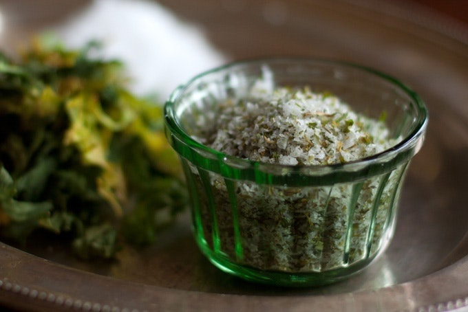

# :leafy_green: Celery Salt

{ loading=lazy }

| :timer_clock: Total Time |
|:-----------------------: |
| 7 minutes |

## :salt: Ingredients

- :leafy_green: 1 bunch leaves from each celery stalk
- :salt: some flaky sea salt

## :cooking: Cookware

- 1 strainer
- 1 baking sheet
- 1 large skillet
- 1 jar

## :pencil: Instructions

### Step 1

Pick the leaves from each celery stalk, leaving the stems behind. The outer leaves tend to be dark green and hearty, the
inner leaves pale green and tender. I use them all.

### Step 2

Rinse the leaves with cold water in a strainer, then shake off as much of the water as you can. At this point you want
to dry the leaves as much as possible, so they toast (not steam) when you cook them. Gently pat them dry in a clean dish
towel, or paper towels. Once dry you have two options for toasting the leaves.

### Step 3

If I have a lot of leaves, I arrange them in a single layer on a baking sheet, then bake in a 350°F / 180°C oven for
about 5 to 7 minutes. Bake until dehydrated and crispy, but not browned.

### Step 4

If I have fewer leaves, or just don't feel like heating the oven, I'll throw them in a large skillet. Single layer if
possible, over medium-low heat. Again, you want to barely toast them, not brown the leaves much.

### Step 5

In either case, when you're done cooking. Remove from heat and let the leaves cool completely. They'll crisp up even
more at this point. When cool, use your fingers to crumble the leaves completely, discarding any leaves that aren't
crispy.

### Step 6

Combine equal parts celery leaves and flaky sea salt in a jar, and either stir or shake to distribute the celery leaves
evenly throughout.

## :link: Source

- <https://www.101cookbooks.com/celery-salt/>
