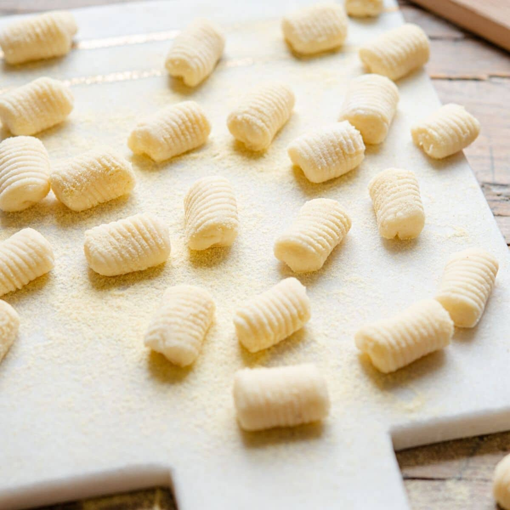

# :potato: Potato Gnocchi

| :fork_and_knife_with_plate: Serves | :timer_clock: Total Time |
|:----------------------------------:|:-----------------------: |
| 10 | 1.03 hours |

## :salt: Ingredients

- :potato: 2 lbs all-purpose or boiling potatoes
- :ear_of_rice: 1.33 cup all-purpose flour
- :salt: 1 tsp salt
- :chestnut: 0.25 tsp nutmeg
- :butter: 3 Tbsp unsalted butter, melted

## :cooking: Cookware

- 1 fork
- 1 potato ricer or sieve
- 1 spoon
- 1 large pot
- 1 baking sheet
- 1 slotted spoon or skimmer
- 1 wide bowl

## :pencil: Instructions

!!! note

    Here is ingenuity at its best-light but substantial and delicious, amiably matched with other flavors, well worth
    the effort. It is traditional to cook and sauce potato gnocchi like pasta and eat them as a first course or
    one-dish meal.

### Step 1

Preheat the oven to 400°F. Scrub well: 2 pounds all-purpose or boiling potatoes.

### Step 2

Prick each potato in a dozen places with a fork. Bake directly on an oven rack until easily pierced with a fork, about 1
hour. While the potatoes are still hot, split therm lengthwise and scoop out the pulp. Push it through a potato ricer or
sieve with the back of a spoon. There should be about 2.66 packed cups. Combine the potatoes in a bowl with 1.33 cups
all-purpose flour, 1 teaspoon salt, and 1/4 teaspoon nutmeg.

### Step 3

Stir vigorously, then turn out onto a work surface knead until smooth and blended. Bring 3 to 4 inches of well-salted
water to a simmer in a large pot. Have ready. 3 tablespoons unsalted butter, melted, or olive oil. Roll about 2
tablespoons of the dough into a 3/4 inch thick cylinder. Cut into 3/4 inch pieces. Roll each piece against the tines of
a fork while pressing a small dent on the opposite side with your finger. Test the gnocchi by dropping a few into the
simmering water and cooking until they float, about 2 minutes. They should hold a firm shape and be chewy to the bite.
If they are too soft or dissolve in simmering water, knead into the dough: (Up to 3 tablespoons all-purpose flour and
Some beaten egg.

### Step 4

Both of these have binding properties. Test again. When the dough is right (keep the water hot), roll it into three or
four 3/4 inch thick ropes. Cut the ropes into 3/4 inch pieces, shape the dough on the fork as below, letting them drop
onto a lightly floured baking sheet. Bring the water back to a simmer. Drop one-third to half of the gnocchi into the
pot and simmer, uncovered, until they float, then remove with a slotted spoon or skimmer to a wide bowl. Drizzle some of
the melted butter over the gnocchi. Toss to coat. Repeat until all the gnocchi are done. Serve hot with: Additional
melted butter and grated Parmesan, a tomato sauce or ragù or Pesto Sauce.

!!! info

    To make gnocchi ahead, spread the uncooked gnocchi on a lightly floured baking sheet and refrigerate, covered with
    plastic wrap, for up to 12 hours. To keep them longer, freeze the gnocchi on the baking sheet until hard, then
    remove to a freezer bag or container; they will keep frozen for up to 1 month. Cook directly from the freezer,
    adding about 1 minute to the cooking time.

## :link: Source

- Joy of Cooking
