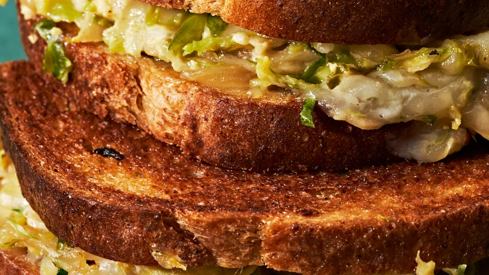

# :sandwich: Brussels Sprout Melts

{ loading=lazy }

| :fork_and_knife_with_plate: Serves | :timer_clock: Total Time |
|:----------------------------------:|:-----------------------: |
| 4 | 47 minutes |

## :salt: Ingredients

- :butter: 8 Tbsp unsalted butter
- :onion: 2 large yellow onions
- :leafy_green: 8 oz Brussels sprouts
- :cheese_wedge: 8 oz Swiss cheese
- :sake: 1 tsp Worcestershire sauce or balsamic vinegar
- :salt: 0.5 tsp kosher salt
- :salt: 0.5 tsp black pepper
- :bread: 8 slices rye bread
- :hotdog: 4 Tbsp [Dijon mustard][1]

## :cooking: Cookware

## :pencil: Instructions

### Step 1

Place 4 tablespoons of the unsalted butter on the counter and let sit at room temperature to soften. Meanwhile, make the
filling.

### Step 2

Halve and thinly slice 2 large yellow onions until you have about 5 cups. Melt the remaining 4 tablespoons unsalted
butter in a large nonstick or cast-iron skillet over medium heat. Add the onions and cook, stirring occasionally, until
jammy and dark brown (similar in color to mahogany), 20 to 25 minutes. This process will take time; don’t rush it. If
the bottom of the pan starts to burn before the onions caramelize, add 1 tablespoon of water to the pan and scrape the
bottom. Repeat this as many times as necessary to prevent burning. Meanwhile, prepare the Brussels sprouts and Swiss
cheese.

### Step 3

Trim the root end from 8 ounces Brussels sprouts and thinly slice into ribbony rounds (about 2 1/2 cups). If needed,
grate 8 ounces Swiss cheese on the large holes of a box grater (about 2 cups).

### Step 4

When the onions are ready, add the Brussels sprouts, 1 teaspoon Worcestershire sauce or balsamic vinegar, 1/2 teaspoon
kosher salt, and 1/2 teaspoon black pepper to the pan. Cook, stirring often, until the Brussels sprouts are tender,
lightly browned in spots, and wilt, 5 to 7 minutes. (If the bottom of the pan starts to burn, continue adding water 1
tablespoon at a time as needed.)

### Step 5

Transfer the mixture to a large bowl and let cool until warm but no longer hot, about 10 minutes. Meanwhile, wash and
dry the pan used to cook the onions.

### Step 6

Add the cheese to the onion mixture and toss to combine. Taste and season with more kosher salt as needed.

### Step 7

Heat the same pan over medium-low heat. Meanwhile, assemble the sandwiches: Spread one side of 8 slices of rye bread
with the softened butter (about 1/2 tablespoon per slice). Flip 4 of the slices over; spread 1 tablespoon
[Dijon mustard][1] on each of these slices. Divide the Brussels sprouts mixture onto the mustard slices and arrange
into an even layer all the way to the edge. Close the sandwiches with the remaining bread slices buttered-side up.

### Step 8

Add 2 of the sandwiches to the pan and cook until the bread is golden brown and the cheese is completely melted, 4 to 5
minutes per side. Transfer to a clean cutting board and repeat cooking the remaining 2 sandwiches. Cut each sandwich in
half.

## :link: Source

- <https://www.thekitchn.com/brussel-sprouts-melts-recipe-23432384>

[1]: <../sauces-and-dressings/dijon-mustard.md>
