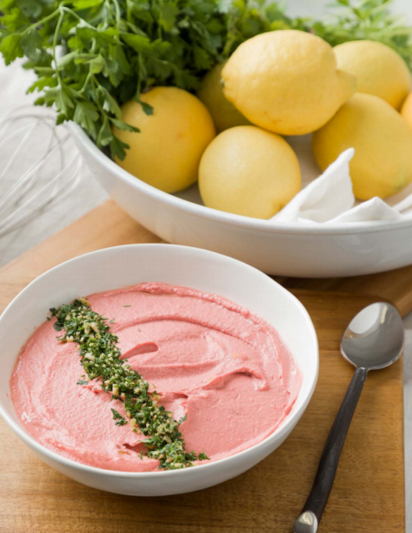

# :sweet_potato: Beet Hummus

{ loading=lazy }

| :fork_and_knife_with_plate: Serves | :timer_clock: Total Time |
|:----------------------------------:|:-----------------------: |
| 8 | 60 minutes |

## :salt: Ingredients

- :sweet_potato: 1 beet
- :olive: 0.33 cup olive oil
- :salt: 1 tsp salt
- :falafel: 1 can, drained chickpeas
- :seedling: 0.67 cup [tahini][1]
- :lemon: 0.33 cup lemon juice
- :garlic: 2 cloves garlic
- :herb: 1 tsp cumin
- :seedling: some radishes (optional)
- :chestnut: some pine nuts (optional)
- :herb: some parsley (optional)
- :lemon: some lemon zest (optional)

## :cooking: Cookware

- 1 tin foil
- 1 food processor or blender
- 1 bowl

## :pencil: Instructions

### Step 1

Preheat oven to 400°F.

### Step 2

Wash the beet and drizzle it with olive oil and salt. Wrap it in tin foil and place it in the oven for about 1 hour.
Allow the beet to cool, then peel and chop.

### Step 3

Combine the beet, chickpeas, [tahini][1], lemon juice, garlic, and cumin in a food processor or blender.

### Step 4

Slowly drizzle in the olive oil and blend until smooth.

### Step 5

Taste and adjust the seasonings and olive oil as needed. Blend until smooth.

### Step 6

Serve in a bowl.

!!! info "Optional toppings"

    Thinly sliced radishes (optional), pine nuts (optional), chopped parsley (optional), lemon zest (optional) or other
    ingredients you have that might compliment this dish. Sprinkle these ingredients on top and enjoy!

## :link: Source

- Applied Kitchen

[1]: <./tahini.md>
